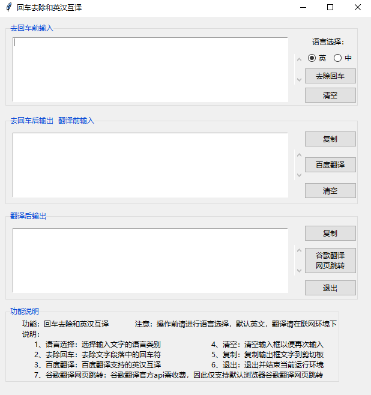
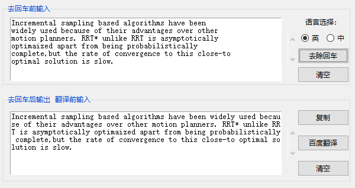
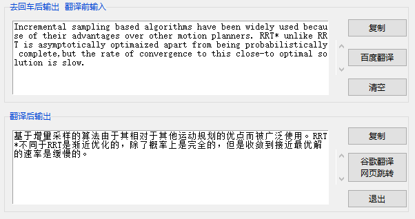

### PDF文字复制后的回车换行符去除和谷歌百度英汉翻译


**痛点：** PDF文档文字复制会包括回车符，使得文字粘贴和翻译都不方便，尤其是对于双栏的PDF。

#### 主界面




#### 详细说明：

**语言选择：** 使用回车去除功能和翻译功能时，一定要先进行语言选择，才能得到正确的结果。选择的语言是输入框中对应的语言类别，默认选择为英文。
**回车去除：** 对于中文，回车符会被直接去除，而对于英文，回车符会被替换为空格以保证英文单词间的分割。



**这里要注意** 的一点是：因为有时候英文论文中每句结尾单词较长时，会以'-'连接，但实际情况中也会有复合单词包含'-'符，因此'-'可能对应多种情况，在该软件中暂未考虑，使用时请自行注意。

**清空：** 清空当前文本框中的内容，以方便再次输入
**复制：** 把当前文本框中的内容复制到剪切板
**退出：** 关闭程序，为防止手滑误点，点击退出按钮后会弹出提示，确认后退出
**百度翻译：** 调用的百度翻译官方api，可以实现英汉互译，但前提是你已进行正确的语言选择。相应实现参考自：[Python3调用百度翻译API，实现实时翻译](https://blog.csdn.net/lcyong_/article/details/79068636)



该软件中，第二个框即是第一个框的输出框，输出去除回车符之后的文字，也是第三个框的输入框，输入要翻译的内容。一二框一起可以单独使用，二三框一起也可以单独使用，即在二框中输入无回车符的内容，选择百度翻译即可得到翻译结果。

**谷歌翻译网页跳转：** 可能百度翻译的结果，你并不满意，可以选择谷歌翻译，但谷歌翻译官方api需收费，当然网上有通过爬虫进行页面爬取的，但谷歌有反爬虫的机制，破解操作较为麻烦，因此这里仅支持默认浏览器谷歌翻译网页跳转。

**注意**：1、首先请一定记得进行语言选择，默认是英文；2、翻译需在联网环境下，默认也仅支持英汉互译；3、如果翻译出错或不是你想要的内容，可能是你忘了语言选择；4、因为是exe文件，因此该可执行文件只能在windows下运行。Linux下可以从终端运行python程序，但要确保安装了相应的库。依赖库包括：

```python
#Tkinter GUI
from tkinter import *
from tkinter.ttk import *
from tkinter.messagebox import *

import pyperclip    #剪切板读写
import webbrowser	#网页跳转

#爬虫和解析
import http.client
import hashlib
import json
import urllib
import random
```


#### 过程记录

- 编程前
  - 列写功能提纲
  - 手绘基本界面
  - 简单学习Python GUI
- 编程中
  - GUI界面搭建
  - 功能函数实现
  - 检查测试完善
- 编程后
  - exe程序生成
  - GitHub上传
  - 博客教程编写


#### 结语

对程序代码细节不关心的可以直接运行exe文件，想了解和学习代码具体实现的可以看一下原码。
该产品也是在业余时间完成，肯定有不完善的地方，有任何问题或需求都可以在issues中提出，你就是我的产品经理~

**对于学习中遇到的问题和痛点，当你尝试自己去解决时，会收获不一样的快乐！**
